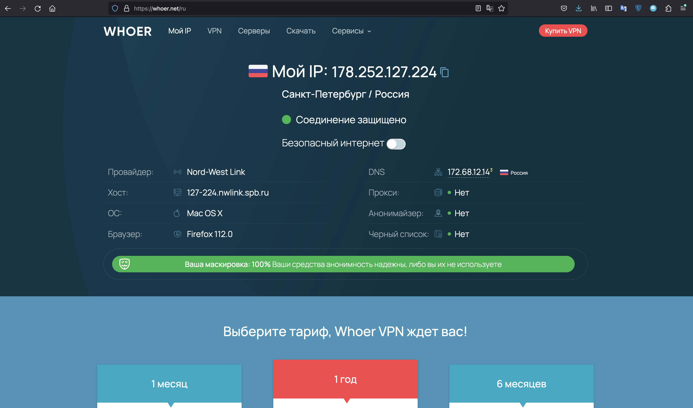

# Домашнее задание к занятию «Компьютерные сети. Лекция 1»

### Цель задания

В результате выполнения задания вы: 

* научитесь работать с HTTP-запросами, чтобы увидеть, как клиенты взаимодействуют с серверами по этому протоколу;
* поработаете с сетевыми утилитами, чтобы разобраться, как их можно использовать для отладки сетевых запросов, соединений.

### Чеклист готовности к домашнему заданию

1. Убедитесь, что у вас установлены необходимые сетевые утилиты — dig, traceroute, mtr, telnet.
2. Используйте `apt install` для установки пакетов.


### Инструкция к заданию

1. Создайте .md-файл для ответов на вопросы задания в своём репозитории, после выполнения прикрепите ссылку на него в личном кабинете.
2. Любые вопросы по выполнению заданий задавайте в чате учебной группы или в разделе «Вопросы по заданию» в личном кабинете.


### Дополнительные материалы для выполнения задания

1. Полезным дополнением к обозначенным выше утилитам будет пакет net-tools. Установить его можно с помощью команды `apt install net-tools`.
2. RFC протокола HTTP/1.0, в частности [страница с кодами ответа](https://www.rfc-editor.org/rfc/rfc1945#page-32).
3. [Ссылки на другие RFC для HTTP](https://blog.cloudflare.com/cloudflare-view-http3-usage/).

------

## Задание

### **Шаг 1.** Работа c HTTP через telnet.

- Подключитесь утилитой telnet к сайту stackoverflow.com:

`telnet stackoverflow.com 80`
 
- Отправьте HTTP-запрос:

```bash
GET /questions HTTP/1.0
HOST: stackoverflow.com
[press enter]
[press enter]
```
*В ответе укажите полученный HTTP-код и поясните, что он означает.*

```bash
Slava@TURBOMac netology % telnet stackoverflow.com 80
Trying 151.101.1.69...
Connected to stackoverflow.com.
Escape character is '^]'.
GET /questions HTTP/1.0
HOST: stackoverflow.com

HTTP/1.0 403 Forbidden
Accept-Ranges: bytes
Content-Length: 1921
Content-Type: text/html
Date: Mon, 29 May 2023 15:10:31 GMT
Retry-After: 0
Server: Varnish
Via: 1.1 varnish
X-Cache: MISS
X-Cache-Hits: 0
X-Dns-Prefetch-Control: off
X-Served-By: cache-osl6529-OSL
X-Timer: S1685373031.056059,VS0,VE1

<!DOCTYPE html>
<html>
<head>
    <meta http-equiv="Content-Type" content="text/html; charset=UTF-8" />
    <title>Forbidden - Stack Exchange</title>
    <style type="text/css">
		body
		{
			color: #333;
			font-family: 'Helvetica Neue', Arial, sans-serif;
			font-size: 14px;
			background: #fff url('img/bg-noise.png') repeat left top;
			line-height: 1.4;
		}
		h1
		{
			font-size: 170%;
			line-height: 34px;
			font-weight: normal;
		}
		a { color: #366fb3; }
		a:visited { color: #12457c; }
		.wrapper {
			width:960px;
			margin: 100px auto;
			text-align:left;
		}
		.msg {
			float: left;
			width: 700px;
			padding-top: 18px;
			margin-left: 18px;
		}
    </style>
</head>
<body>
    <div class="wrapper">
		<div style="float: left;">
			
		</div>
		<div class="msg">
			<h1>Access Denied</h1>
                        <p>This IP address (185.253.97.180) has been blocked from access to our services. If you believe this to be in error, please contact us at <a href="mailto:team@stackexchange.com?Subject=Blocked%20185.253.97.180%20(Request%20ID%3A%20315822864-OSL)">team@stackexchange.com</a>.</p>
                        <p>When contacting us, please include the following information in the email:</p>
                        <p>Method: block</p>
                        <p>XID: 315822864-OSL</p>
                        <p>IP: 185.253.97.180</p>
                        <p>X-Forwarded-For: </p>
                        <p>User-Agent: </p>

                        <p>Time: Mon, 29 May 2023 15:10:31 GMT</p>
                        <p>URL: stackoverflow.com/questions</p>
                        <p>Browser Location: <span id="jslocation">(not loaded)</span></p>
		</div>
	</div>
	<script>document.getElementById('jslocation').innerHTML = window.location.href;</script>
</body>
</html>Connection closed by foreign host.
Slava@TURBOMac netology %
```

В моем случае при попытке обращения к ресурсу был получен ответ с ошибкой ```HTTP/1.0 403 Forbidden```.
HTTP 403 Forbidden — стандартный код ответа HTTP, означающий, что доступ к запрошенному ресурсу запрещен. Сервер понял запрос, но не выполнит его.

---

### **Шаг 2.** Повторите задание 1 в браузере, используя консоль разработчика F12:

 - откройте вкладку `Network`;
 - отправьте запрос [http://stackoverflow.com](http://stackoverflow.com);
 - найдите первый ответ HTTP-сервера, откройте вкладку `Headers`;
 - укажите в ответе полученный HTTP-код;
 - проверьте время загрузки страницы и определите, какой запрос обрабатывался дольше всего;
 - приложите скриншот консоли браузера в ответ.


Получен ответ "HTTP 200 OK" - запрос выполнен успешно.
Время загрузки страницы - 5.99 секунд.
Дольше всего обрабатывался запрос страницы https://stackoverflow.com (на скриншоте выше список отсортирован по времени обработки).

---

### **Шаг 3.** Какой IP-адрес у вас в интернете?



---

### **Шаг 4.** Какому провайдеру принадлежит ваш IP-адрес? Какой автономной системе AS? Воспользуйтесь утилитой `whois`.

```bash
Slava@TURBOMac netology % whois 178.252.127.224
% IANA WHOIS server
% for more information on IANA, visit http://www.iana.org
% This query returned 1 object

refer:        whois.ripe.net

inetnum:      178.0.0.0 - 178.255.255.255
organisation: RIPE NCC
status:       ALLOCATED

whois:        whois.ripe.net

changed:      2009-01
source:       IANA

# whois.ripe.net

inetnum:        178.252.127.0 - 178.252.127.225
netname:        NWLINK-NET
descr:          NWLINK-NET2
country:        RU
admin-c:        RC6422-RIPE
tech-c:         RC6422-RIPE
status:         ASSIGNED PA
mnt-by:         NWLINK-MNT
created:        2010-12-13T12:00:44Z
last-modified:  2010-12-13T12:00:44Z
source:         RIPE

person:         Rjevkin Constantine
address:        Russia, 196240,Saint-Petersburg, 23B, Egorova
phone:          +7 905 2166789
nic-hdl:        RC6422-RIPE
created:        2007-04-16T07:58:43Z
last-modified:  2020-06-04T07:32:57Z
source:         RIPE
mnt-by:         NWLINK-MNT

% Information related to '178.252.112.0/20AS42893'

route:          178.252.112.0/20
descr:          Home Internet ltd 4
origin:         AS42893
mnt-by:         NWLINK-MNT
created:        2010-06-15T09:54:31Z
last-modified:  2010-06-15T09:54:31Z
source:         RIPE

% This query was served by the RIPE Database Query Service version 1.106.1 (BUSA)


Slava@TURBOMac netology %
```

IP адрес **178.252.127.224** принадлежит провайдеру ```NWLINK-MNT``` и связан с автономной системой AS42893.

---

#### **Шаг 5.** Через какие сети проходит пакет, отправленный с вашего компьютера на адрес 8.8.8.8? Через какие AS? Воспользуйтесь утилитой `traceroute`.

```bash
vagrant@vagrant:~$ traceroute -A --icmp 8.8.8.8
traceroute to 8.8.8.8 (8.8.8.8), 30 hops max, 60 byte packets
 1  _gateway (10.0.2.2) [*]  0.405 ms  0.314 ms  0.253 ms
 2  192.168.1.1 (192.168.1.1) [*]  2.394 ms  2.884 ms  2.806 ms
 3  10.139.84.125 (10.139.84.125) [*]  4.472 ms  4.899 ms  4.797 ms
 4  * * *
 5  * * *
 6  74.125.244.132 (74.125.244.132) [AS15169]  4.377 ms  8.349 ms  8.264 ms
 7  142.251.61.219 (142.251.61.219) [AS15169]  8.180 ms  7.924 ms  7.827 ms
 8  172.253.79.113 (172.253.79.113) [AS15169]  7.190 ms  7.096 ms  7.024 ms
 9  * * *
10  * * *
11  * * *
12  * * *
13  * * *
14  * * *
15  * * *
16  * * *
17  * * *
18  dns.google (8.8.8.8) [AS15169]  15.288 ms  15.144 ms  14.983 ms
vagrant@vagrant:~$
```

Маршрут пакетов:

1. `_gateway` - Локальная сеть
2. `192.168.1.1` - домашний роутер
3. `10.139.84.125` - возможно, какой-то узел интернет-провайдера 
4. `* * *` - неизвестно, возможно, какой-то узел интернет-провайдера или узел, проигнорировавший наш запрос
5. `* * *` - неизвестно, возможно, какой-то узел интернет-провайдера  или узел, проигнорировавший наш запрос
6. `74.125.244.132 (74.125.244.132) [AS15169]  4.377 ms  8.349 ms  8.264 ms` - промежуточный узел в автономной системе AS15169
7. `142.251.61.219 (142.251.61.219) [AS15169]  8.180 ms  7.924 ms  7.827 ms` - промежуточный узел в автономной системе AS15169
8. `172.253.79.113 (172.253.79.113) [AS15169]  7.190 ms  7.096 ms  7.024 ms` - промежуточный узел в автономной системе AS15169
9-17. `* * *` - неизвестно, несколько узлов, проигнорировавших наш запрос
18. `dns.google` (8.8.8.8) - искомый узел, находящийся в автономной системе AS15169

---

#### **Шаг 6.** Повторите задание 5 в утилите `mtr`. На каком участке наибольшая задержка — delay?


---
**Шаг 7.** Какие DNS-сервера отвечают за доменное имя dns.google? Какие A-записи? Воспользуйтесь утилитой `dig`.

**Шаг 8.** Проверьте PTR записи для IP-адресов из задания 7. Какое доменное имя привязано к IP? Воспользуйтесь утилитой `dig`.

*В качестве ответов на вопросы приложите лог выполнения команд в консоли или скриншот полученных результатов.*

----

### Правила приёма домашнего задания

В личном кабинете отправлена ссылка на .md-файл в вашем репозитории.


### Критерии оценки

Зачёт:

* выполнены все задания;
* ответы даны в развёрнутой форме;
* приложены соответствующие скриншоты и файлы проекта;
* в выполненных заданиях нет противоречий и нарушения логики.

На доработку:

* задание выполнено частично или не выполнено вообще;
* в логике выполнения заданий есть противоречия и существенные недостатки. 
