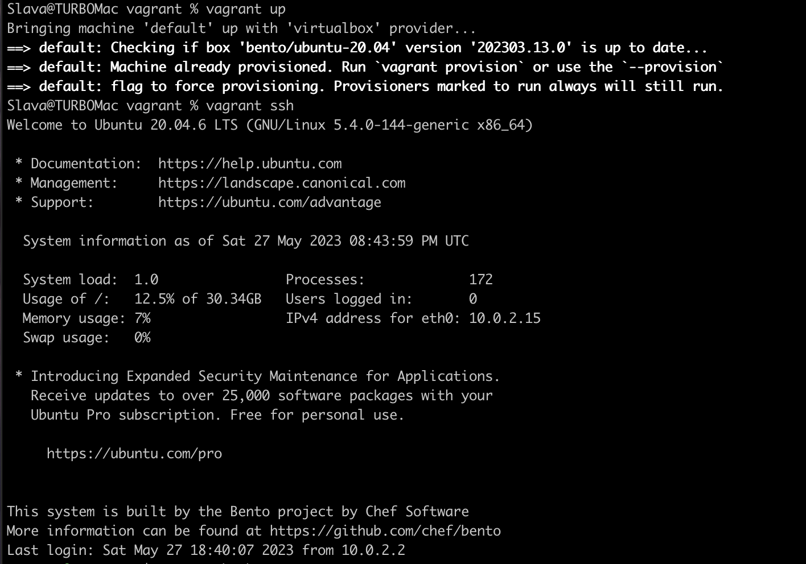
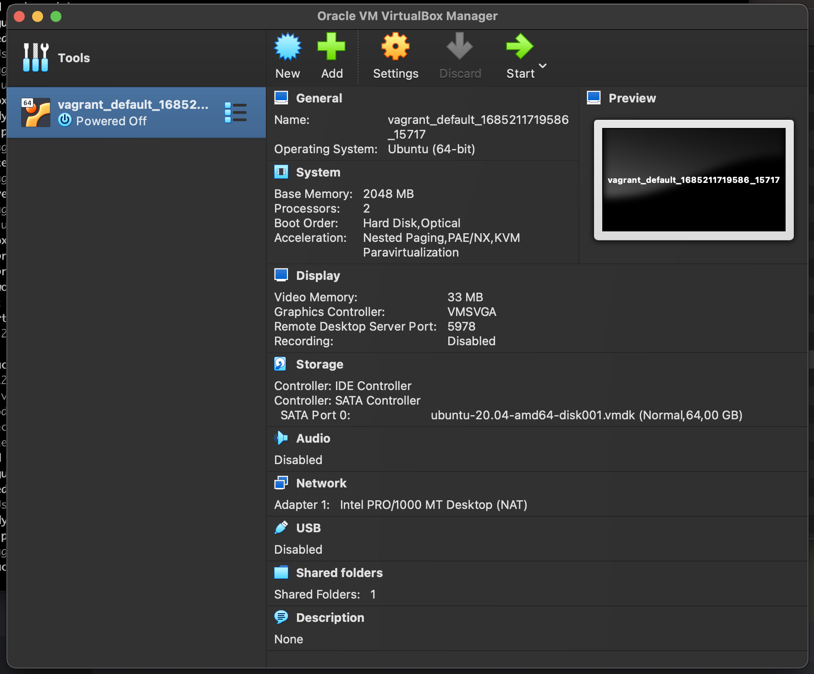
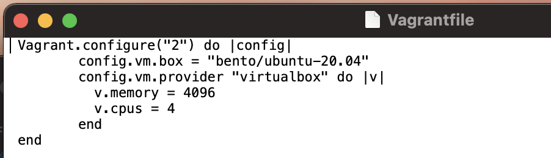
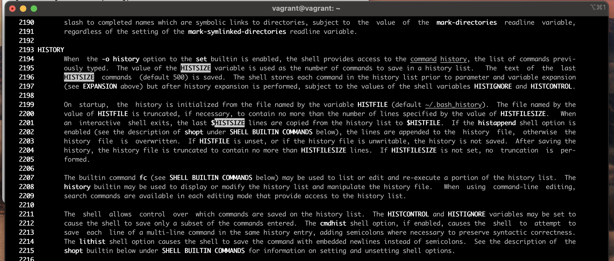
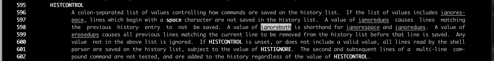
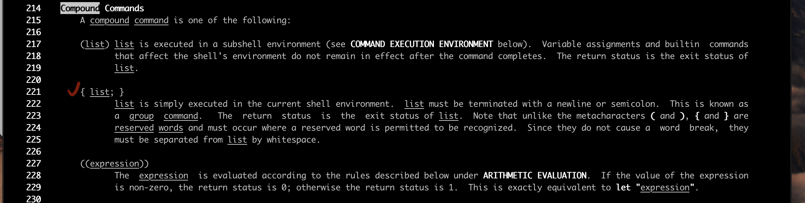
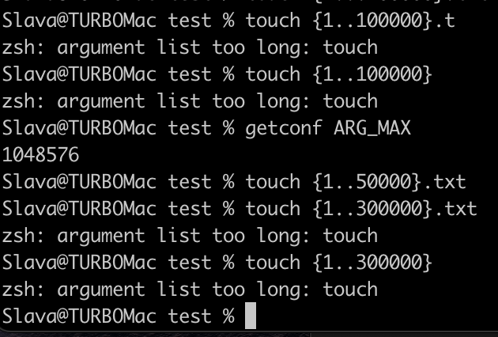
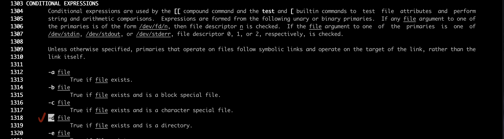
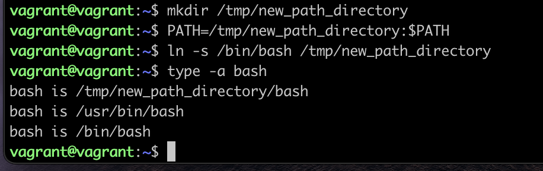

# Домашнее задание к занятию «Работа в терминале. Лекция 1»

### Цель задания

В результате выполнения задания вы:

* научитесь работать с базовым функционалом инструмента VirtualBox, который помогает с быстрой развёрткой виртуальных машин;
* научитесь работать с документацией в формате man, чтобы ориентироваться в этом полезном и мощном инструменте документации;
* познакомитесь с функциями Bash (PATH, HISTORY, batch/at), которые помогут комфортно работать с оболочкой командной строки (шеллом) и понять некоторые его ограничения.


### Инструкция к заданию

1. Установите средство виртуализации [Oracle VirtualBox](https://www.virtualbox.org/).
1. Установите средство автоматизации [Hashicorp Vagrant](https://hashicorp-releases.yandexcloud.net/vagrant/).
1. В вашем основном окружении подготовьте удобный для дальнейшей работы терминал. Можно предложить:

	* iTerm2 в Mac OS X;
	* Windows Terminal в Windows;
	* выбрать цветовую схему, размер окна, шрифтов и т.д.;
	* почитать о кастомизации PS1 и применить при желании.

	Несколько популярных проблем:
	
	* добавьте Vagrant в правила исключения, перехватывающие трафик, для анализа антивирусов, таких, как Kaspersky, если у вас возникают связанные с SSL/TLS ошибки;
	* MobaXterm может конфликтовать с Vagrant в Windows;
	* Vagrant плохо работает с директориями с кириллицей (может быть вашей домашней директорией), тогда можно либо изменить [VAGRANT_HOME](https://www.vagrantup.com/docs/other/environmental-variables#vagrant_home), либо создать в системе профиль пользователя с английским именем;
	* VirtualBox конфликтует с Windows Hyper-V, и его необходимо [отключить](https://www.vagrantup.com/docs/installation#windows-virtualbox-and-hyper-v);
	* [WSL2](https://docs.microsoft.com/ru-ru/windows/wsl/wsl2-faq#does-wsl-2-use-hyper-v-will-it-be-available-on-windows-10-home) использует Hyper-V, поэтому с ним VirtualBox также несовместим;
	* аппаратная виртуализация (Intel VT-x, AMD-V) должна быть активна в BIOS;
	* в Linux при установке [VirtualBox](https://www.virtualbox.org/wiki/Linux_Downloads) может дополнительно потребоваться пакет `linux-headers-generic` (debian-based) / `kernel-devel` (rhel-based).


### Дополнительные материалы для выполнения задания

1. [Конфигурация VirtualBox через Vagrant](https://www.vagrantup.com/docs/providers/virtualbox/configuration.html).
2. [Использование условий в Bash](https://www.gnu.org/software/bash/manual/html_node/Bash-Conditional-Expressions.html).

------

## Задание

>1. С помощью базового файла конфигурации запустите Ubuntu 20.04 в VirtualBox посредством Vagrant:
>
>	* Создайте директорию, в которой будут храниться конфигурационные файлы Vagrant. В ней выполните `vagrant init`. Замените содержимое Vagrantfile по умолчанию >следующим:
>
>		```bash
>		Vagrant.configure("2") do |config|
>			config.vm.box = "bento/ubuntu-20.04"
>		end
>		```
>
>	* Выполнение в этой директории `vagrant up` установит провайдер VirtualBox для Vagrant, скачает необходимый образ и запустит виртуальную машину.
>
>	* `vagrant suspend` выключит виртуальную машину с сохранением её состояния — т. е. при следующем `vagrant up` будут запущены все процессы внутри, которые работали на >момент вызова suspend, `vagrant halt` выключит виртуальную машину штатным образом.
>



>2. Изучите графический интерфейс VirtualBox, посмотрите, как выглядит виртуальная машина, которую создал для вас Vagrant, какие аппаратные ресурсы она выделила. Определите, >какие ресурсы выделены по умолчанию.



>3. Познакомьтесь с возможностями конфигурации VirtualBox через Vagrantfile: [документация](https://www.vagrantup.com/docs/providers/virtualbox/configuration.html). Изучите, >как добавить оперативную память или ресурсы процессора виртуальной машине.



4. Команда `vagrant ssh` из директории, в которой содержится Vagrantfile, позволит вам оказаться внутри виртуальной машины без дополнительных настроек. Попрактикуйтесь в выполнении обсуждаемых команд в терминале Ubuntu.

>5. Изучите разделы `man bash`, почитайте о настройках самого bash:
>
>    * какой переменной можно задать длину журнала `history`, и на какой строчке manual это описывается?
>    * что делает директива `ignoreboth` в bash?



Задать длину журнала `history` можно задать переменной HISTSIZE. Но если задана переменная HISTFILESIZE, файл журнала будет обрезаться до этого значения в байтах.



Директива `IGNOREBOTH` эквивалентна набору директив `IGNORESPACE` и `IGNOREDUPS`:

- При указании директивы `IGNORESPACE` в журнал не записываются строки, начинающиеся на пробел (символ space)
- При указании директива `IGNOREDUPS` в журнал не записываются строки, которые уже есть в журнале (были добавлены ранее)

Таким образом директива `IGNOREBOTH` позволяет не записывать в журнал дубликаты строк и строки, начинающиеся на пробел.


>6. В каких сценариях использования применимы скобки `{}`, на какой строчке `man bash` это описано?



- При задании групповых команд (скобки являются как зарезервированными слова и должны отделяться пробелом или другим метасимволом).

```console
vvagrant@vagrant:~$ { echo "A" ; echo "B"; }
A
B
```

- При формировании строк с использованием списков и диапазонов.

  Список

```console
vagrant@vagrant:~$ echo file_{one,two,three}.dat
file_one.dat file_two.dat file_three.dat
vagrant@vagrant:~$
```

  Диапазон

```console
vagrant@vagrant:~$ echo file_{1..3}.dat
file_1.dat file_2.dat file_3.dat
vagrant@vagrant:~$
```

- Для явного указание имени переменной.

```console
vagrant@vagrant:~$ echo BEGIN${PATH}END
BEGIN/usr/local/sbin:/usr/local/bin:/usr/sbin:/usr/bin:/sbin:/bin:/usr/games:/usr/local/games:/snap/binEND
vagrant@vagrant:~$
```

- Для указания элемента: `echo file${array[7]}.txt`

>7. С учётом ответа на предыдущий вопрос подумайте, как создать однократным вызовом `touch` 100 000 файлов. Получится ли аналогичным образом создать 300 000 файлов? Если >нет, то объясните, почему.



В моем случае максимальный размер командной строки (ARG_MAX) превышается уже при попытке создания 100000 файлов с самым простым именем.
Для создания 50000 файлов параметра ARG_MAX хватило.

>8. В man bash поищите по `/\[\[`. Что делает конструкция `[[ -d /tmp ]]`?



Конструкция `[[ <выражение> ]]` возвращает 0 или 1 в зависимости от результата выполнения `<выражение>`: 0 - успешно, 1 - неуспешно.
Выражение `-d /tmp` означает проверку существования каталога `/tmp`

То есть, целиком выражение `[[ -d /tmp ]]` проверяет существование каталога `tmp` в корне файловой системы.

>9. Сделайте так, чтобы в выводе команды `type -a bash` первым стояла запись с нестандартным путём, например, bash is... Используйте знания о просмотре существующих и >создании новых переменных окружения, обратите внимание на переменную окружения PATH.
>
>	```bash
>	bash is /tmp/new_path_directory/bash
>	bash is /usr/local/bin/bash
>	bash is /bin/bash
>	```
>
>	Другие строки могут отличаться содержимым и порядком.
>    В качестве ответа приведите команды, которые позволили вам добиться указанного вывода, или соответствующие скриншоты.



Команда `type` с ключом `-a` выводит все места, содержащие указанное исполняемое имя.

Действия:
1. Создать требуемый каталог: `mkdir /tmp/new_path_directory`
2. Добавить каталог в переменную `PATH`, причём в начало списка: `PATH=/tmp/new_path_directory:$PATH`
3. Создать символьную ссылку `bash` для данного каталога: `ln -s /bin/bash /tmp/new_path_directory`

>10. Чем отличается планирование команд с помощью `batch` и `at`?

Команда `at` - планирование запуска задачи в указанное время.
Команда `batch` - планирование запуска задачи в зависимости от нагрузки на систему: задача запустится при снижении нагрузки на систему ниже определённого уровня.

11. Завершите работу виртуальной машины, чтобы не расходовать ресурсы компьютера или батарею ноутбука.

*В качестве решения дайте ответы на вопросы свободной форме.* 

---

### Правила приёма домашнего задания

В личном кабинете отправлена ссылка на .md-файл в вашем репозитории.

### Критерии оценки

Зачёт:

* выполнены все задания;
* ответы даны в развёрнутой форме;
* приложены соответствующие скриншоты и файлы проекта;
* в выполненных заданиях нет противоречий и нарушения логики.

На доработку:

* задание выполнено частично или не выполнено вообще;
* в логике выполнения заданий есть противоречия и существенные недостатки.  
